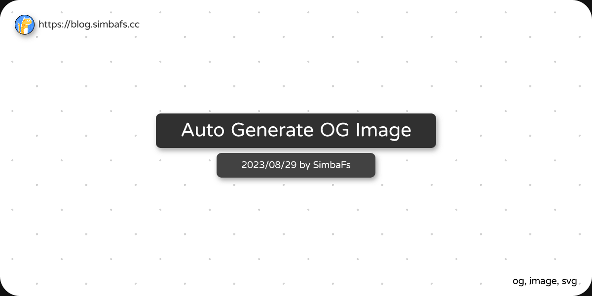

# getOG
statically generate og image in png based on provided information

## Installation
```
$ npm i @simbafs/og
```

## usage
### CLI
```
$ node index.js path/to/your/post.md
```

```
Usage: index [options] <input> [output]

Arguments:
  input              the input markdown file
  output             the output png file, default og/${input}

Options:
  --author <name>
  --font <path>
  --template <path>
  -h, --help         display help for command
```

the generated og image will be placed in `og/path/to/your/post.png`

### Lib
```js
const { getOg, getOgFromMd } = require('@simbafs/og')
const fs = require('fs')

getOg({ 
    title: 'Auto Generate OG Image',
    subtitle: '2023/08/29 by SimbaFs',
    tags: ['og', 'image', 'svg'],
}).then(({ png, svg} => fs.writeFileSync('og.png', png))

// or auto read and write
getOg({
    inFile: 'path/to/your/post.md',
    outFile: 'og.png',
})
```



## Docs
### getOg
TODO

### getOgFromMd
TODO
